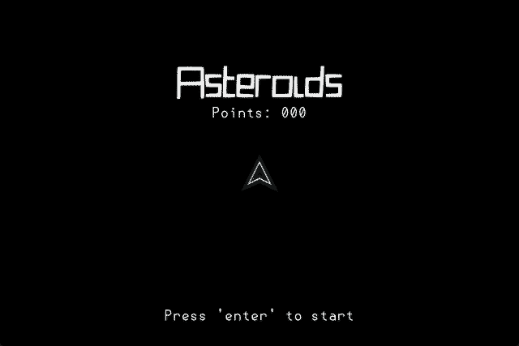

 

Asteroids is a remake of the famous [Asteroids]() game. You can move around using W/A/D (no S) and shoot by pressing space. The goal is to destroy as many asteroids without dying. Asteroids will split up to 3 times. Your ship will teleport to the opposite border when you try to go out of bounds.

 

 

# Features
- Fly around as a ship
- Destroy Asteroids
- Gain Points
- Fly (or actually don't) fly out of bounds
- other cool effects
- Press F5 for some cool debugging stats

# Run
- Play the game on https://asteroids.jamedev.top
- Build it yourself and run it via love

# Development
This game was made using
- Lua 5.4.8
- Love2D 11.5

# Commits
This github project uses Conventional Commit Messages with gitmoji. I would recommend installing the following extension: 
https://marketplace.visualstudio.com/items?itemName=vivaxy.vscode-conventional-commits

# License
This project is published under the [MIT LICENSE](LICENSE)

# Other
This project is made for hackclubs siege event main week 7 (week 11 total)

